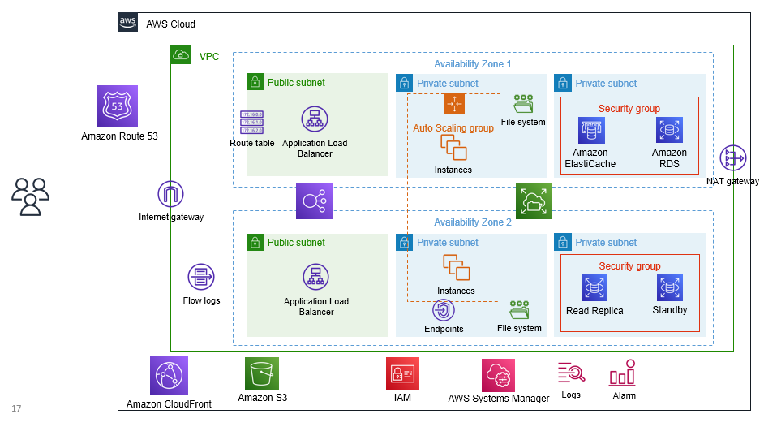

# Node Demo

This repository contains demo application for introductory AWS presentation covering foundational services and building HA applications on AWS.

## Architecture

This architecture presented is a 3-tier web application following AWS best practices.

Currently this repository only contains basic CloudFormation template to provision the necessary networking for deployment.

## Code

This application is built with NodeJS and ReactJS and demonstrates how code running inside EC2 connects to an RDS database and a ElastiCache cluster. It is also configured to use EC2 UserData and send logs to CloudWatch.